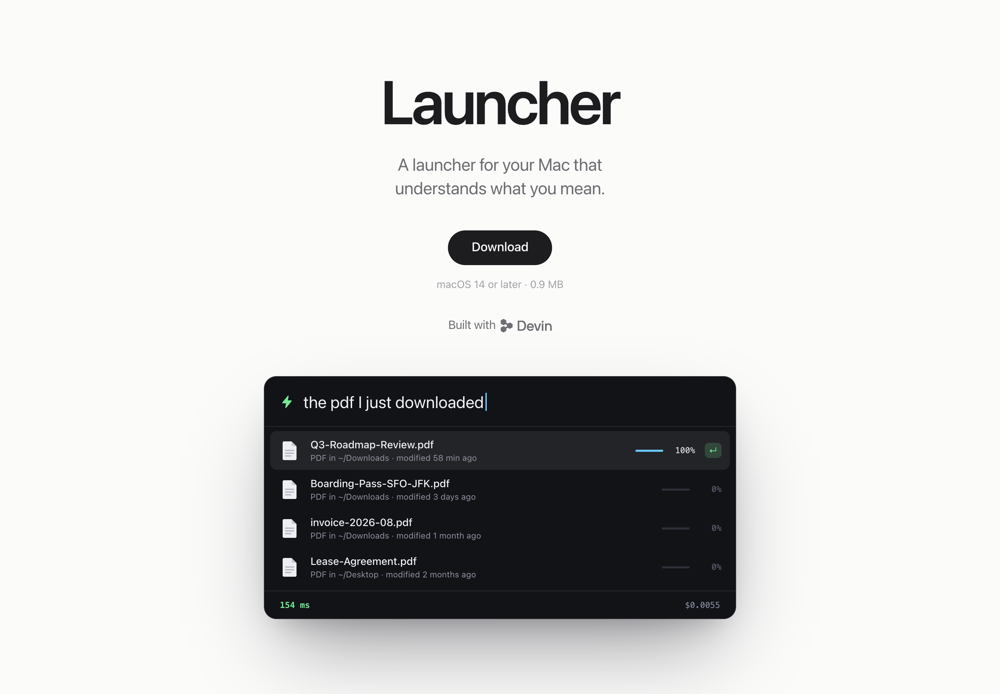
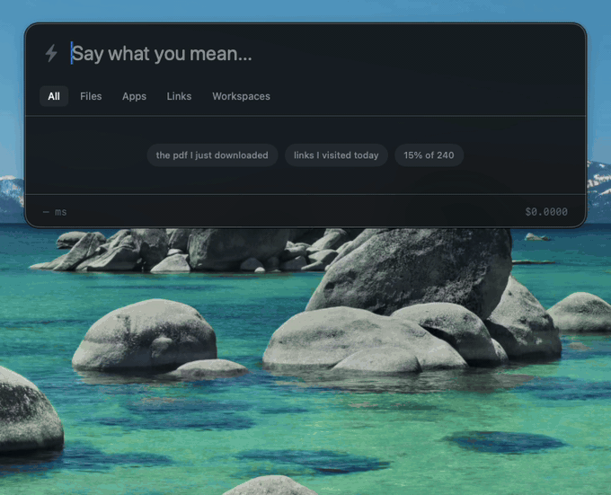

# Launcher



A Spotlight-style launcher for macOS that reads intent, not strings. Press ⌥Space and type the way you would say it: `dark`, `wifi off`, `15% of 240`, `the pdf I just downloaded`, `open the devin ambassador links I visited in the past 24 hours`. On every keystroke the panel sends what you typed, a little local context and the best local candidates to [Jev](https://docs.typesafe.ai) in one request. Jev answers a handful of typed questions (which candidate, what kind of action, one item or all of them, which rows fit, is this settled enough to run on Enter), the list re-ranks live, and when the intent is clear the top row gets a green ↵. Enter runs it: one file, one toggle, or a whole set of links at once.




## Why speed matters

A launcher is judged per keystroke. Anything above roughly 200 ms feels like lag, which is why nobody puts a general LLM (2 to 4 seconds) between the keyboard and the results list. Jev returns the full judgment in about 100 ms from this VM, so the list re-ranks on every character with no debounce. Each query change fires a request tagged with a sequence number; the newest answer wins and anything older is discarded. Nothing waits on the network: the fuzzy order is on screen immediately and Jev's answer replaces it when it lands.

## What it does

### Single targets

| Query | Top hit | Jev target probability |
|---|---|---|
| `dark` | Toggle Dark Mode | 99% |
| `wifi off` | Turn Wi-Fi Off (not Turn Wi-Fi On, which has the same fuzzy score) | 100% |
| `15% of 240` | `= 36`, evaluated in code; Enter copies it | 100% |
| `the pdf I just downloaded` | `Q3-Roadmap-Review.pdf`, the newest of six PDFs | 100% |
| `sleep` | Sleep | 99% |

The fuzzy matcher alone cannot tell `invoice-2026-08.pdf` from `Q3-Roadmap-Review.pdf` on the PDF query; both match "pdf" and "downloaded" equally. Jev reads the `modified 16 min ago` detail against "just downloaded" and puts all of the probability on the newest one.

### One item or all of them

`open devin ambassador links I visited in the past 24 hours` produces the second screenshot above. In order:

1. **Time window, in code.** `TimeWindow.parse` recognises `past 24 hours`, `last hour`, `yesterday`, `today`, `this week`, `last month`, `this morning`, `earlier today`, `a few days ago` and similar phrases and turns them into a `since`/`until` pair. Only candidates dated inside the window are eligible, the phrase is stripped from the text that gets fuzzy-matched, and the window is sent to Jev as `time_window`.
2. **Chrome history, in code.** `ChromeHistory` copies each profile's `History` SQLite file (Chrome keeps the original locked), reads the last 90 days of `urls`, keeps `http(s)` only, merges duplicates across profiles and turns each row into a candidate: page title, host, `visited 2 h ago`, plus host and title words as keywords. Only the rows that survive the window and the fuzzy filter are sent (up to 30 with a window, 13 without). The database never leaves the machine.
3. **Two extra questions in the same request.** `scope` is a Choice between `one` (a specific item) and `all` (every candidate that fits). `match_cN` is one Noul per real candidate: does this row fit the description? This is the [rerank pattern](https://docs.typesafe.ai/cookbooks/rerank_typesafe) from the TypeSafe cookbooks. Both come back in the same round trip as `target`, `action` and `ready`.
4. **Group row, in code.** Rows with `match ≥ 0.6` (at least two, at most 25) form the set. The panel adds a synthetic `Open all 3 links` row: first when `P(all) ≥ 0.5`, right under the best single hit when Jev is torn (`0.15 ≤ P(all) < 0.5`), and not at all when the query is clearly about one thing (`P(all) < 0.15`). Members get a checkmark; ↓ still walks through them one by one. The group row is ready only when `P(all) ≥ 0.75`.
5. **Enter opens them.** URL groups go to Chrome in one `NSWorkspace.open(_:withApplicationAt:)` call (default browser if Chrome is not installed); other members run through the normal single-item path. Nothing runs without Enter.

The same machinery is not Chrome-specific. `the files I downloaded in the last hour` yields `Open all 3 files` over the PDFs modified in the last hour, with older ones excluded in code before Jev sees them. Mixed sets (`Open all 4 items`) work too.

| Query | P(all) | Top row | Set |
|---|---|---|---|
| `open devin ambassador links I visited in the past 24 hours` | 1.00 | Open all 3 links | three Ambassador pages at 0.89 to 0.94; GitHub, Hacker News and TypeSafe docs from the same day at 0.06 or less; a 70-hour-old duplicate excluded by the window |
| `the files I downloaded in the last hour` | 1.00 | Open all 3 files | the three PDFs modified in the last hour |
| `pages about typesafe I read today` | 0.99 | System One, TypeSafe Docs | one match, so no group row |
| `the pdf I just downloaded` | 0.00 | Q3-Roadmap-Review.pdf (target 1.00) | none offered, even though five PDFs individually fit |
| `dark`, `wifi off` | 0.00 | Toggle Dark Mode, Turn Wi-Fi Off | none |

## Measured numbers

All figures are from real runs on this macOS VM (macOS 26.5, ARM64, Xcode 26.6) against `jev-latest`, which resolved to `jev-1.13.0`. Latency is the full HTTPS round trip measured in the app, including network and inference.

| Metric | Value |
|---|---|
| Median round trip (p50) | about 100 ms for single-target queries |
| p95 round trip | about 200 to 300 ms |
| First request of a session | about 500 ms (TLS setup) |
| Set query with a time window (30 candidates) | 160 to 330 ms, about 2.7k input tokens |
| Input tokens per decision | about 1,400 without a window, up to 3,700 with one |
| Output tokens | 0; typed judgments never generate text |
| Cost per keystroke | about $0.00006 at $0.042 per million input tokens |
| Cost of a five-query session | about $0.003 |

Every question in a request comes back in the same round trip, so five judgments per keystroke cost the same latency as one. The footer shows the last round trip on the left and the running cost on the right; hovering it shows p50, p95, decision count and tokens per decision.

## How the Jev request is built

One `POST /v1/systemone` per keystroke with `model: jev-latest`. Jev never generates text; it picks among options the code supplies. Everything else (indexing, fuzzy prefiltering, time parsing, arithmetic, execution) is plain Swift.

**State** (`Sources/JevQuestions.swift`):

```json
{
  "query": "the pdf I",
  "query_note": "Text the user has typed so far into a Spotlight-style macOS launcher. It is often an incomplete prefix or a short natural-language phrase.",
  "context": { "frontmost_app": "Finder", "recent_apps": ["Finder", "Safari"], "clipboard_kind": "text", "time_of_day": "afternoon", "weekday": "Thursday" },
  "time_window": null,
  "candidates": [
    { "id": "c0", "kind": "open_file", "title": "Q3-Roadmap-Review.pdf", "detail": "PDF in ~/Downloads · modified 16 min ago" },
    { "id": "c1", "kind": "open_file", "title": "invoice-2026-08.pdf", "detail": "PDF in ~/Downloads · modified 1 month ago" },
    { "id": "c6", "kind": "web_search", "title": "Search the web for “the pdf I”", "detail": "Opens your default browser" }
  ]
}
```

Candidates are the top 13 fuzzy matches from the local index (30 when the query names a time window) plus synthetic rows: an arithmetic result when the query parses, and a web search for any non-empty query. They carry short ids (`c0` to `cN`) that the code maps back to real candidates when the answer arrives, so Jev only ever sees a few dozen rows, never the whole index or the browser history.

**Questions**, all in one `questions` object:

1. `target`: Choice over `c0` to `cN` plus `none`. Which entry is the item they intend to open or run, treating `query` as a possibly incomplete prefix or paraphrase and matching on meaning. The full distribution is used: each row's percentage is `probabilities[cK]`.
2. `action`: Choice over `open_app`, `open_file`, `open_url`, `web_search`, `calculate`, `system_toggle`, `run_shortcut`, `unclear`, each with a one-line rubric. A candidate whose `kind` matches the chosen action gets a ranking boost.
3. `ready`: Noul. The launcher is about to run the best candidate the instant Enter is pressed; is `query` already unambiguous enough for that? The top row gets the green ↵ when this is at least 0.6, or when Jev gives one target at least 90%. The second rule exists because on the PDF query `ready` hedges around 0.4 while `target` is 98 to 100% on the newest file.
4. `scope`: Choice between `one` and `all`, described above.
5. `match_cN`: one Noul per real candidate (synthetic calculator and web rows excluded), described above.

**Ranking** is deterministic given the answer: `score = 0.65 · P(target) + 0.20 · P(action matches kind) + 0.15 · fuzzy`, plus `0.25 · P(all) · P(match)` for rows in the set so members sit together under the group row. Without an answer the score is just `fuzzy`.

**In-flight handling**: every query change increments a sequence number and starts a `Task`. A response is applied only if its sequence is newer than the last one applied. While a newer request is in flight the previous judgment is kept, dimmed, so the list does not flicker back to fuzzy order between keystrokes. The green ↵ hides as soon as ↑/↓ moves the selection off the top row, since Enter then runs whatever is selected.

### Iteration notes

The `ready` wording went through several rounds against the five queries plus deliberately ambiguous ones. The first version ("is this unambiguous?") scored 0.3 to 0.4 even for `dark`. Telling Jev that `candidates` is the complete option set, that `web_search` is only a fallback, and giving one concrete example of a short but unambiguous prefix produced this spread:

| Query | Candidates | `ready` |
|---|---|---|
| `calc 15% of 240` | = 36, Calculator, web | 0.88 |
| `the pdf I just downloaded` | 3 PDFs of different ages, web | 0.84 |
| `dark` | Toggle Dark Mode, web | 0.64 |
| `da` | Toggle Dark Mode, Dashboard, web | 0.29 |
| `sle` | Sleep, Slack, web | 0.29 |
| `wifi` | Turn Wi-Fi Off, Turn Wi-Fi On, web | 0.16 |
| `s` | Sleep, Safari, Slack, web | 0.13 |

`wifi` alone is correctly not ready (on or off?) while `wifi off` is; `sle` is correctly torn between Sleep and Slack. The `target` question needed an explicit hint that `detail` carries recency before "the pdf I just downloaded" reliably preferred the newest file over the alphabetically first one. `ready` is worded for a single target and stays low (around 0.2) on set queries, which is why group readiness uses `P(all)` instead.

## What is local (code, not Jev)

- **Index** (`LocalIndex.swift`): `.app` bundles in `/Applications`, `/System/Applications`, `/System/Applications/Utilities`; files in `~/Downloads`, `~/Desktop`, `~/Documents` (top level plus one nested level, capped at 400 per folder, with modification age in the subtitle); user Shortcuts from `shortcuts list`; nine system toggles; Chrome history (`ChromeHistory.swift`, every `Default` and `Profile *` under `~/Library/Application Support/Google/Chrome`, last 90 days, 3,000 rows). The index is rebuilt in the background each time the panel is shown.
- **Time windows** (`TimeWindow.swift`): relative (`past 24 hours`, `last 3 days`, `a couple of weeks ago`), named (`today`, `yesterday`, `this week`, `last month`, `this morning`, `tonight`, `last night`, `just now`, `recently`) and number words, resolved against the local calendar.
- **System toggles** (`Executor.swift`): Dark Mode (AppleScript to System Events), Wi-Fi on/off (`networksetup -setairportpower`), Do Not Disturb (opens Focus settings), Sleep (AppleScript), Lock Screen (`CGSession -suspend`), Empty Trash (AppleScript to Finder), Show/Hide hidden files (`defaults write` plus `killall Finder`).
- **Calculator** (`Calculator.swift`): a recursive-descent parser for `+ - * / ^ ( )`, `x` as multiply, `sqrt`, percentages (`15% of 240`, `200 * 10%`), with an optional `calc` or `=` prefix. No `NSExpression`, no eval.
- **Fuzzy prefilter** (`Fuzzy.swift`): exact, prefix, word-initial and subsequence scoring over title and keywords, with natural-language filler (`the`, `open`, `pages`, `about`, `read`, and so on) stripped so it never crowds out the words that matter.
- **Execution**: `NSWorkspace.open` for apps, files and web searches; URLs and URL groups go to Chrome when installed (default browser otherwise), passed as values, never through a shell; the calculator result is copied to the clipboard.

## Run

Requirements: macOS 14 or later, Xcode 16 or later (built with 26.6), a TypeSafe API key, and [XcodeGen](https://github.com/yonaskolb/XcodeGen) only if you change `project.yml` (the generated project is committed).

```sh
git clone https://github.com/dabit3/launcher.git
cd launcher
export TYPESAFE_API_KEY=...        # read from the environment; never hardcoded
./run.sh --show                    # builds Debug and launches with the panel open
```

`run.sh` execs the binary from the shell so the environment variable is inherited. If you launch the `.app` from Finder instead, the key is read from the Settings field (menu bar ⚡, then Settings, stored in `UserDefaults` under `typesafeAPIKey`). With no key the panel still works as a fuzzy launcher and the empty state says so.

- **⌥Space** toggles the panel from anywhere (Carbon `RegisterEventHotKey`; no Accessibility permission needed).
- **↑ / ↓** move the selection, **↵** runs it, **esc** hides the panel. The example chips in the empty state (`dark`, `wifi off`, `15% of 240`, `the pdf I just downloaded`, `links I visited today`) are clickable.
- The menu-bar ⚡ item has Toggle Launcher, Settings and Quit. The app has no Dock icon (`LSUIElement`).
- The panel is a translucent `NSVisualEffectView` HUD that resizes to its content (up to seven rows). App and file rows show the real Finder icon; toggles, the calculator, web search, links and group rows use tinted SF Symbols. A small dot next to the field shows while a request is in flight; the bolt turns green when the top row is ready. The footer is just latency and cost.

### Permissions

- **Automation (Apple Events)**: the first Dark Mode, Sleep or Empty Trash toggle prompts to control System Events or Finder. `NSAppleEventsUsageDescription` is set in `project.yml`. The build is unsandboxed so it can read the folders it indexes.
- **Wi-Fi** toggling uses `networksetup`, which may ask for an administrator password on some macOS versions.
- **Folders**: macOS asks once for Downloads, Desktop and Documents. Chrome's history lives under `~/Library/Application Support`, which needs no prompt.
- Nothing else: no Accessibility, Screen Recording or Full Disk Access.

## Build and test

```sh
xcodebuild -project Launcher.xcodeproj -scheme Launcher -configuration Debug \
  -destination 'platform=macOS' -derivedDataPath build CODE_SIGNING_ALLOWED=NO build
xcodebuild -project Launcher.xcodeproj -scheme Launcher -configuration Debug \
  -destination 'platform=macOS' -derivedDataPath build CODE_SIGNING_ALLOWED=NO test
xcrun swift-format lint --strict --recursive Sources Tests
```

58 tests cover the calculator, fuzzy scorer, prefilter and ranker, request construction and response parsing, latency and cost statistics, recency phrasing, file candidates, Wi-Fi port parsing, Chrome timestamp conversion, reading a copied `History` database, time-window parsing and filtering, set membership, group placement and the `scope` and `match_cN` questions. 53 run offline; `LiveJevTests` (5) hit the real API and are skipped unless `JEV_LIVE=1` and `TYPESAFE_API_KEY` are set in the test runner. See [TESTING.md](TESTING.md) for the manual checklist and fixture setup.

## Download and site

Build `Launcher.dmg` locally with `./scripts/make-dmg.sh`; it packages a Release `Launcher.app` and an Applications shortcut. The build is unsigned and not notarized.

The static marketing site is in [`site/`](site/README.md). Open `site/index.html` directly or publish that folder on any static host. Its Download button points to `https://github.com/dabit3/launcher/releases/latest/download/Launcher.dmg`, so release assets must use that filename.

Launcher was extracted from `dabit3/jev-experiments`. It keeps the original `com.devin.typesafe.jev-launcher` bundle identifier so existing Settings preferences remain available; Jev and TypeSafe still name the ranking provider.

## Limitations

- **The list is always shown.** Hiding it on a probabilistic signal felt wrong for a launcher, so readiness is the green ↵ on the top row; Enter always runs the selected row regardless.
- **Latency is network-bound.** The numbers above are from a US VM; p50 will track your distance to `api.typesafe.ai`.
- **Fast typists generate stale answers.** Typing far faster than about 10 characters per second produces overlapping requests. The newest answer always wins, but the stale count climbs and p95 rises.
- **Context is minimal.** `frontmost_app`, `recent_apps`, `clipboard_kind`, `time_of_day` and `weekday` are sent; the app does not read window titles, open browser tabs or clipboard contents. Chrome history is read locally and only the rows that match the query and time window are sent, as title plus host plus relative visit time.
- **Chrome only, and only visits.** Safari's history is not read (it needs Full Disk Access); the Chrome `downloads` table and open tabs are not used. History is indexed when the panel opens, so a page visited seconds ago appears on the next ⌥Space.
- **Set thresholds are tuned by hand** on the queries above (`Ranker.setThreshold`, `memberThreshold`, `offerThreshold`).
- **Files are indexed by modification time**, not last-opened time, so "the pdf I just downloaded" is exact while "the last pdf I opened" resolves to the most recently modified one.
- The files and history entries in the screenshots are fixtures created on the VM; TESTING.md recreates them.
